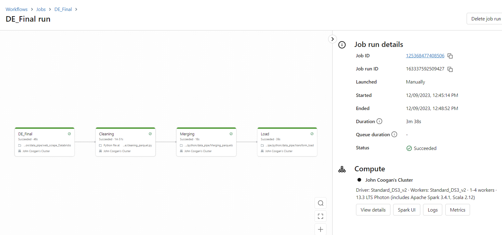
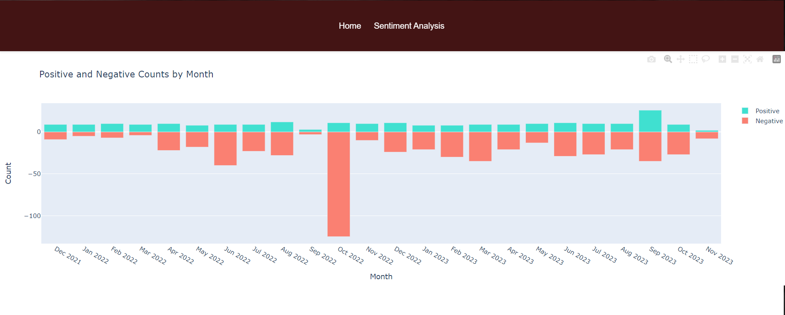
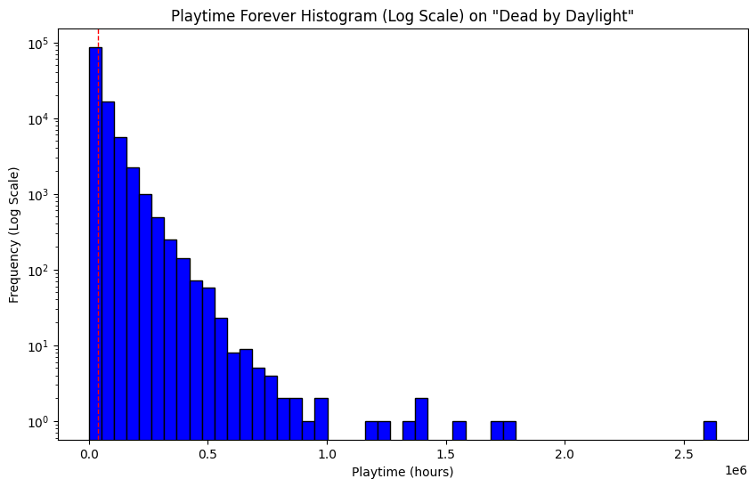
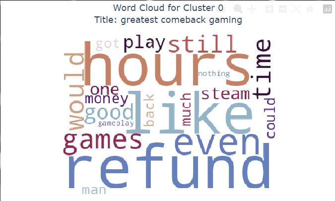
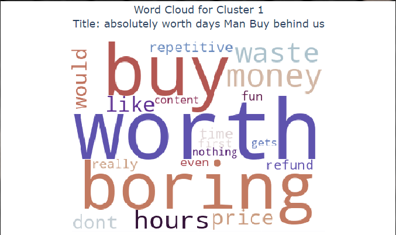
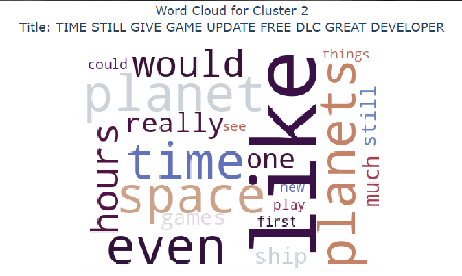
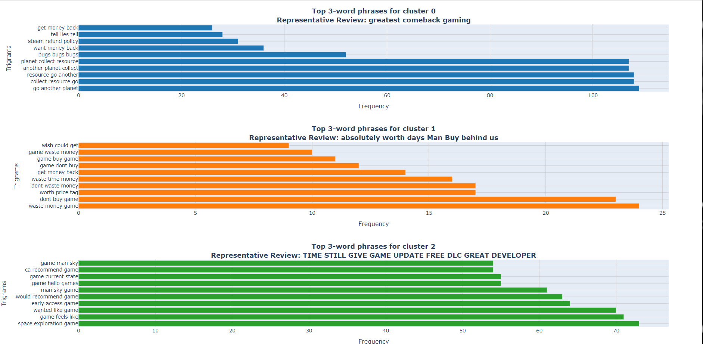
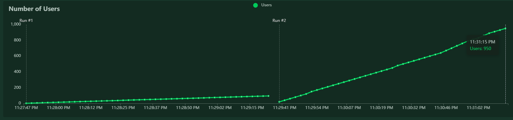
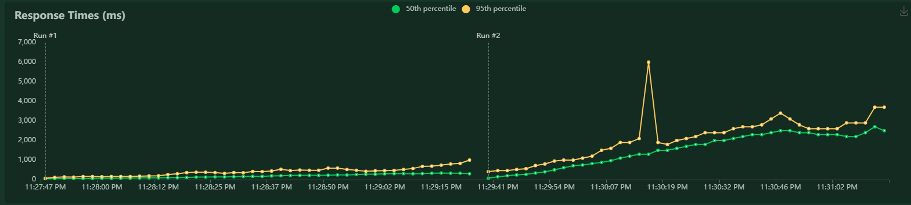

[](https://github.com/nogibjj/Steam_Review__Analyzer/actions/workflows/format.yaml) [](https://github.com/nogibjj/Steam_Review__Analyzer/actions/workflows/download.yaml) [](https://github.com/nogibjj/Steam_Review__Analyzer/actions/workflows/lint.yaml) [](https://github.com/nogibjj/Steam_Review__Analyzer/actions/workflows/test.yaml)


## Demo Video for Individual Project 4 (kh509)
https://youtu.be/y3ojSb7losU

# Steam Review Analytics Dashboard

## A dashboard created using DevOps principles to provide various insights based off of reviews left on gaming market place Steam, and some of its biggest games

### Contributions by: Kian Bagherlee, Yabei Zeng, Katelyn Hucker, John Coogan, and Suim Park

The following in a comprehensive report that will explain the full Data Engineering project, including its functionality, its limitations, and the tools used. 

### Project Overview

This analytics Dashboard was created to be able to derive insights from the reviews left under certain large games in the Steam marketplace. Steam is an open-source gaming marketplace that provides the feature for users to leave positive and negative reviews under the various games. These reviews are presented as JSON files when utilizing Steam's API, which will provide the review, and other accompanying data for it.

This dashboard is a Python written interactable microservice, which utilizes an ETL pipeline in Azure Databricks. The microservice is contained in DockerHub, easily reproducible with the provided DockerImage, and hosted on Azure Web App to a public endpoint. It presents the information as an interactable website, created using Flask. It accepts user input, and will then process various types of graphs computed with the parameters requested from the user (these parameters are used in a SQL query to derive the proper information).

### The Games Analyzed

The games chosen were due to both their size and their diversity. The goal was to get data on different game genres, as different genres vary in both what people look for paired with what criticisms are valid, as well as different sizes. Larger titles, from well established AAA companies, tend to have certain stigmas around them that spoil the reviews, compared to indie games. Lastly, the games were chosen based on their review distribution. The goal was to choose a collection of games that are applauded for being well made, and games that were degraded for a myriad of reasons. In the end, the following games were selected in the end.

* Dead by Daylight
* Fallout 4
* Stardew Valley
* Rust
* No Man's Sky
* Sea of Thieves
* Phasmaphobia

### The ETL Pipeline

The data for this project is web scraped through the python requests package and automated through Azure Workflows. In deployment, this pipeline runs as a scheduled job to continually update our microservice database with the most up to date game information. Below we can see the pipeline as it exists on the Azure portal. 

This pipeline takes in raw webscrape data as a json payload which is converted into a raw parquet file format. From there the files are individually cleaned with timestamps reformatted, application of english filters, and added columns to identify the games once they are placed into our database. Finally, we merge these files together and load that into a delta table. The delta lake architecture allows us to perform multiple queries at once on the data through the meta-data layer. This provides our web application a useful degree of scalability

The result of this ETL pipeline will create our Delta Table, called '''final_steam_table''', which will house every single review for every single game. This will also hold the variety of columns with information that the team used to derive analytical insights, as well as what game the review is actually attached too, which is necessary for identification.

### Analytics Derived

Our service takes user selected video games and queries our database in real time to deliver responsive insights to the user. The first visualization that the user sees is an interactive histogram of positive and negative plots (static image shown below). This gives immediate insights to a user for how well a game is performing on Steam's platform and closely mirrors the insights the platform provides as well.


### User Playtime Histogram
Our service provides histograms that show the amount of time users spend playing each game, indirectly revealing their opinions about the games. These graphs are categorized into three types: total playtime up to now, playtime over the last two weeks, and playtime at the point of writing a review. For effective visualization, we have represented the number of users on a log scale. By examining the distribution of users' playtime, we can determine whether a game is consistently popular, just a passing trend, or if it has a loyal user base.


#### Text Related Graphs
To go beyond the telemetry provided by the Steam Platform, we generated two types of graphs based on the text data in the reviews of our video games. The two graphs are clustered using tokenization, TFIDF Vectorization and then MiniBatchKmeans with 3 clusters. This methodolgy is meant to identify like reviews and group them together, so that developers can highlight issues or positive traits about their game in a snapshot. These cluster results were then outputted in two forms: a word map and a bar chart. See the description below. 


The wordmap graphs display the three clusters generated from the clustering scripts. It ouputs the most frequented words talked about within each cluster. The larger the size the more it was talked about. The title at the top is a review which was written by a user that is the most representative of that cluster. Therefore, this is the title of that cluster. It is really interesting to see the different groupings of reviews and how closely they are related to the title.



This bar plot is a list of the most said 3 word phrases within cluster. We see a lot of more common game problems, economics, or developer problems in these trigrams. Therefore developers can look more into problems and how they should fix them.

### Dashboard Display

The dashboard is fully displayed utilizing the Python package ```Flask```, which is an easy way to combine written Python code and HTML code. The HTML code is necessary to have an attractive interface, with simple UI features, to facilitate the information for thet user. The HTML code was written to have a display page that requests a selection of a game, a date range of interest, and a month/day of interest. 

From here, the microservice displays a "waiting" page, which is meant to indicate to the user that inforamtion is being prepared. Once ready, the microservice will finally show the dashboard itself. This will have a variety of graphs, explained as well, so that the user can interact and understand. There will also be a button to allow the user to enter another game, or change their query selection.

### Data Engineering with Azure

After the user inputs a few parameters, the code will begin its interaction with Azure Databricks. Immediately, the code will check on whether the cluster designated for this project is currently running. If it is not, the code will automatically begin spinning up this cluster. The cluster has a 10 minute inactivity limit for turning off, in attempt to save money. If the cluster is currently running, it will then execute a SQL query. This SQL query will be unique, as it will combine a pre-set skeleton with the user inputs. After query execution, the data will be saved as a ```pandas``` DataFrame. The reason this data structure was chosen was due to its easy compatibility with ```plotly```, which was used to create the interactive graphs. The added benefit of utilizing Azure Databricks was to be able to utilize an effective, and powerful, Infrastructure as Code (IaC) solution.

### Docker

This project is currently contained on DockerHub, accessible with this link https://hub.docker.com/repository/docker/kbagherlee22/steam_review_analyzer/general

 The Dockerfile, currently located in ```src/web_app```, is used to make the DockerImage for the entire microservice. From here, the container is pushed to Azure Web App, so that the entire dashboard can be deployed to a public endpoint. With this public endpoint, it becomes easier for anyone to access the dashboard. The utilization of Docker and Azure Web App was paired with the thought of, once the pipeline was established, the entire dashboard becomes easily scaleable.

 The following are Key Metrics from the Azure Web App, to demonstrate that the container was correctly pushed and deployed to a public endpoint.

 

### GitHub Actions

The group implemented a GitHub Actions to promote a CI/CD pipeline. The checkpoints that were established was utilizing ```Ruff``` to lint the code, ```Black``` to format the code, a tester to ensure that all packages were properly downloaded from the ```requirements.txt``` file, and ```PyTest``` as our actual code tester. The group did not stop until it was ensured that everything was passed, functioning properly, and looked presentable. This projects GitHub badges are shown above.

### Load Testing and Quantitative Assessment

As this application could forsee a future with mutliple users, the group decided to load test. Utilizing ```locust```, the group was able check how many users the application can withstand before failing. Setting a maximum of 1,000 users attempting to utilize the microservice, the results below show how successful the entire project was of withstanding a large amount of incoming traffic. The code displaying the behaviors each of these users did is represented in ```locustfile.py```.



Along with withstanding a large amount of users, the team felt it would be a success if the average latency per request was anywhere below a minute. This is under the condition that the cluster was already spun, as it takes ~5 minutes for the cluster to initially be created, which severely impacts the latency. The following graph below shows the success.



### How to Run the Project

A big question remains: How can one run this application locally? To run, all that needs to be performed are the following steps.

1. Clone this respository
2. Run ```make install```, to get the Python version, as well as all the packages, running on your local device
3. Either run directly from ```app.py```, or utilize the ```Flask``` CLI, and set ```FLASK_APP=app.py```, then run ```flask run```

From there, you will get to see the entire application from local. This is also due to the .devcontainer configuration that was downloaded from the repository, which allows easy use of this application within GitHub Codespaces.

### Limitations and Potential Improvement

There were many limitations that occured throughout the creation of this project. First is related to the actual data collection itself. Steam's API is limited on how many requests can be made, where each review is a request to their system. As a result, after a good amount of reviews, the system would place the request under a "timeout" that lasted ~5 minutes. This made data collection a long and strenuous process, as well as made it time consuming to request the reviews for more popular games.

The second limitation came with the reviews themselves. Sometimes the reviews had nothing to do with the games themselves, and were used to make a joke. Other times, the review would express immense distaste for the game before labeling their review as positive. A large number of reviews were labelled as being in English and were not, either being written in another language or being full of emojis. 

A third limitation is how slow Azure Databricks takes to spin up a cluster. As a result, if the user is the first person to attempt to access the cluster in ~10 minutes, it will take almost 5 minutes to start up again. This overhead time is paired with the time necessary to perform the other analysis, which could take longer than what any user is willing to wait. Keeping the cluster constantly on is not a valid solution to this problem, as the cost will quickly pile-up. While these issues are tedious, deviating from Azure Databricks as a whole becomes another issue has many decisions were made surrounding the available tools Azure provides.

From this point, there are a few potential improvements. One is moving the entire project infrastructure to AWS, which comes with pros and cons. While it will speed-up the entire latency time, it will also take significant time to learn the tools AWS uses, and port everything over. The second potential improvement is the add a sentiment analysis feature, which will provide a second interactable feature for users. As well, it can be used to derive a more accurate sentiment on the reviews under a game, which was highlighted earlier as a big issue.

### Utilization of AI Pair Programming Tools

Throughout this project, many team members utilized a variety of different AI Pair Programming tools, the two main tools being ChatGPT and GitHub Copilot. These tools were primarily used for debugging purposes, as working with ```Flask``` and HTML as a whole was entirely new for many team members. These tools were able to explain many of the bugs, and offer insight on how one could potentially implement the wishes of the team into HTML.

The other main use was to explain the interaction between any python file and the project cluster/delta table. This is because utilizing the Databricks REST API was initially difficult, and many approaches were found online with little success. These tools were able to offer a single method, which was then suplemented with the implemetation needed for this project. 

### Architectural Diagram


### Demo Video

{PLACE DEMO VIDEO HERE}
